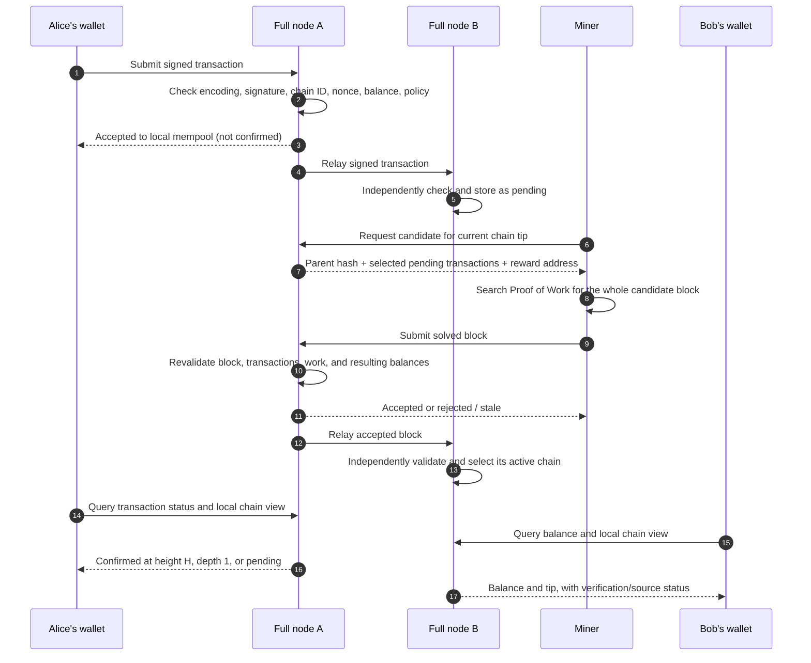
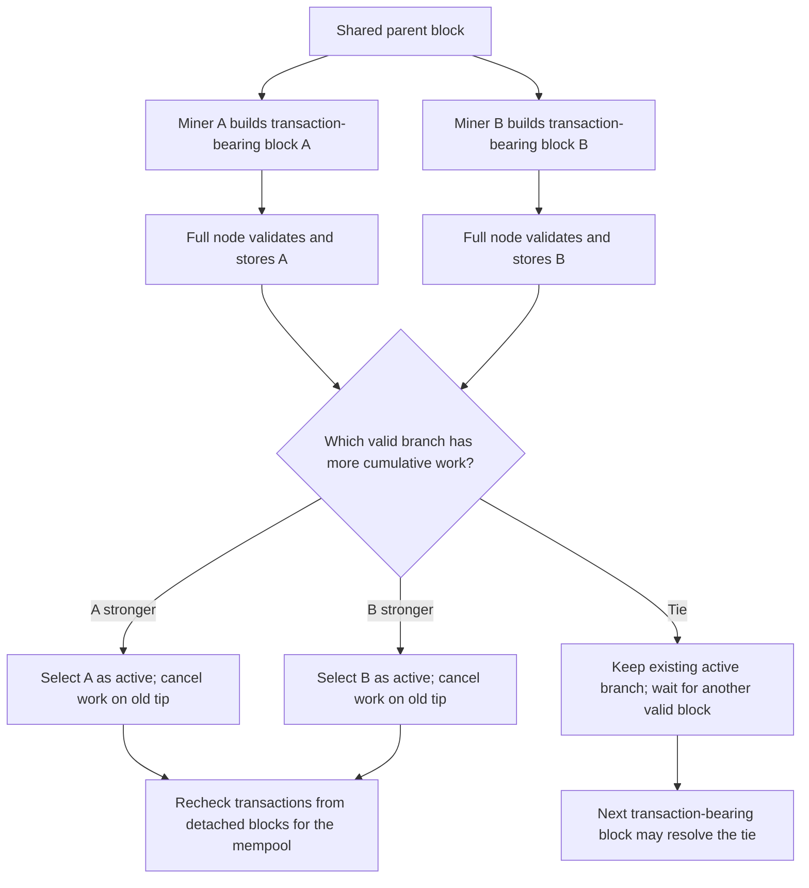

# How a BBC v2 Transaction Moves Through the Network

This is a **proposed v2 behavior description**, not a claim that the simplified
CLI or non-empty-block rule already exists. The current wire protocols are
documented in [transaction propagation](../transaction-protocol-v1.md),
[mining](../mining-protocol-v1.md), and [synchronization](../sync-protocol-v1.md).
The [glossary](../glossary.md) explains mempool, nonce, fork, and reorganization.

## Initial funding

Canonical Genesis gives every account zero BBC. The exceptional first mined
block at height 1 contains no ordinary payment and credits the exact founder
allocation frozen in the network manifest. The previously discussed 1,000 BBC
is illustrative until confirmed. This block requires valid Proof of Work.
Every full node independently validates this allocation before accepting the
block. Once the founder's wallet sees the accepted chain, the founder can
create the first ordinary payment. A later block is invalid unless it contains
at least one valid ordinary transaction.

## A normal payment

Suppose Alice sends BBC to Bob. The wallet is an encrypted key holder, not a
central account server. It creates a canonical transaction containing the
recipient, integer amount and fee in base units, Alice's next account nonce,
and the network chain ID. It signs locally. The private key and password never
travel to a full node or miner.

Full node A does not hand the miner a permanently approved payment. It chooses
transactions that are valid *against its current view*. A competing block may
change the balance or nonce before the miner finishes. Therefore the solved
block is checked again. Every other full node repeats that check; acceptance by
A is not an instruction to B.

Proof of Work is performed for one block header committing to all selected
transactions. The miner does not find a separate valid hash per transaction.
The maximum number of transactions in one block and the exact subsidy function
remain consensus parameters. The current implementation's limit is 1,000,
but v2 must explicitly freeze its own value.

## What the statuses mean

| State | Meaning for Alice and Bob |
| --- | --- |
| Created | Alice signed locally; no full node has accepted it yet. |
| Pending | At least one full node accepted it into its local mempool; another may reject or not have seen it. |
| Confirmed, depth 1 | The transaction is in the currently selected valid block. |
| Confirmed, depth 2 or more | One or more later valid blocks extend that history. |
| Reorganized | A stronger branch replaced a block; the payment may return to pending or become invalid. |
| Rejected/unknown | A node rejected it, or the queried node has no matching record; investigate the reason and chain tip. |

Because v2 does not allow ordinary empty blocks, confirmation depth advances
only when later transaction-bearing blocks are mined. If no one sends another
payment, a depth-1 payment may stay at depth 1 indefinitely. A recipient must
choose a confirmation policy appropriate to that limitation; a displayed
balance should include the tip height and source of its chain view.

## Competing miners and branches

Two miners may start from the same parent and include overlapping transactions.
Their blocks are alternatives, not pieces to merge. A full node can store both
valid branches but selects one active chain according to cumulative work. With
v2 difficulty adjustment, work must be calculated from each block's actual
validated target; the current fixed-target shortcut of one work unit per block
would no longer be sufficient.

If Alice's payment was only in the branch that loses, its earlier confirmation
disappears from the active chain. The node may return it to the mempool after
checking its nonce, balance, and conflicts again. Bob should not interpret a
single node's pending result or one recent block as irreversible finality.

## Fees, subsidy, and idle periods

The sender's fee moves existing BBC to the miner who wins the accepted block.
The block subsidy creates new BBC according to the future published schedule.
The founder's height-1 allocation is a separate one-time rule. No later
reward-only block is accepted, and the ordinary miner waits when there is no
eligible transaction. This means no new issuance or new confirmations during
idle periods.

A funded miner can send a valid transaction between addresses it controls to
make a non-empty block candidate. The network can check signatures, balances,
nonces, fees, and Proof of Work, but cannot determine whether two addresses
belong to different people. Minimum fees and relay limits can raise abuse
costs, but do not make a self-transfer distinguishable from a genuine payment.
